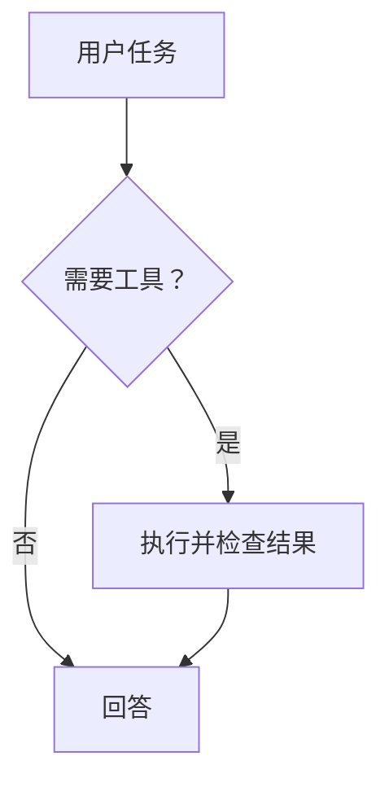

# Pi ACP Workbench

一个通过 **Agent Client Protocol（ACP v1）** 接入 Pi Agent 的 VS Code 插件。提供侧栏对话、流式回答、代码上下文、工具执行卡片和 diff 预览，重点增强 Markdown 与数学公式体验。

本项目是独立实现，并非 Pi、OpenAI 或 Anthropic 的官方插件。面向常见编码助手工作流；不宣称与 Codex / Claude Code 的所有功能等价。

## 安装与使用

### 1. 准备 Pi

在运行 VS Code 扩展宿主的机器上安装 Node.js 22+，按 [Pi ACP 适配器说明](https://github.com/svkozak/pi-acp) 安装 Pi 并配置模型供应商：

```bash
npm install -g @earendil-works/pi-coding-agent
pi
```

在 Pi 的交互界面完成登录或 API key 配置。插件复用 Pi 的凭据，不单独收集模型密钥。如果所用 Pi 版本仍使用旧 npm 包名，请遵循对应 Pi 版本的安装文档；适配器必须与本机 Pi 版本兼容。

### 2. 安装 VSIX

在 VS Code 的扩展面板菜单选择 **Install from VSIX…**，选择 `pi-acp-workbench-0.2.0.vsix`，或执行：

```bash
code --install-extension pi-acp-workbench-0.2.0.vsix
```

打开并信任项目文件夹 → 点击活动栏的 **π**，插件会自动连接本地 Agent。连接失败或意外断开时才显示 **重新连接** 按钮。连接成功后输入任务，Enter 发送，Shift+Enter 换行。生成过程中可点击 **停止**。

按钮、模型选择器和上下文圆环的说明在悬停或键盘聚焦时立即显示统一的主题浮层，按 Esc 可关闭。上滑阅读历史时，可点击消息区底部居中的圆形箭头回到最新消息。错误提示右侧的 **×** 可关闭当前错误，后续错误仍会正常显示。

**不配置模型也可以体验渲染**：命令面板执行 `Pi: Preview Markdown & Math`。

### 3. 配置 ACP 启动命令

默认使用随插件打包的增强 Pi ACP 适配器（固定上游 `pi-acp@0.0.34`），无需全局安装 `pi-acp`。Pi 本体仍需安装。若 VS Code 找不到 `pi`，设置 `piAcp.env.PI_ACP_PI_COMMAND` 为 Pi 可执行文件的绝对路径；保留默认 command / args 即可启用完整统计及分块摘要能力。

需要自定义外部 ACP 进程时，参数直接传给进程，不经过 shell，例如：

```json
{
  "piAcp.command": "/absolute/path/to/pi-acp",
  "piAcp.args": [],
  "piAcp.env": {},
  "piAcp.showThoughts": true,
  "piAcp.persistHistory": true,
  "piAcp.maxContextChars": 60000
}
```

Windows 也优先使用默认内置适配器。仅在自定义外部适配器时，可使用 Node 和适配器的 JS 入口；可用 `npm root -g` 找到全局模块目录：

```json
{
  "piAcp.command": "C:\\Program Files\\nodejs\\node.exe",
  "piAcp.args": ["C:\\Users\\YOUR_NAME\\AppData\\Roaming\\npm\\node_modules\\pi-acp\\dist\\index.js"]
}
```

同样支持其他 **ACP v1 stdio agent**：修改 command / args 即可。`piAcp.useBundledAdapter: false` 可显式恢复全局 `pi-acp`。命令面板中的 `Pi: Open Login Terminal` 在内置模式打开 `pi`，外部模式调用配置命令的 `--terminal-login`；其他 Agent 应在自己的终端工具中认证。ACP v2 草案不在本版支持范围内。

## 使用体验

- **流式聊天**：支持 assistant、thought、tool、plan、usage 更新；用户向上滚动后不强制跳回底部。
- **模型和思考模式**：根据 Agent 返回的 `configOptions` / `modes` 动态显示，不硬编码模型名。适配器不提供时不显示。
- **上下文**：编辑器右键 `Pi: Add Selection to Chat` 或 Ctrl+Alt+P / Cmd+Alt+P；无选区时附加当前文件。发送前可移除。读取当前编辑器内容，包含未保存修改。最多 8 个附件，单个默认上限 60,000 字符，超过会提示缩小选区。
- **Slash 命令**：输入 `/` 展示 Agent 声明的命令；点击插入。也可以直接发送 `/compact` 等文本命令。
- **工具调用**：增量更新状态、位置、输出；结构化 `diff` 支持在 VS Code 中左右对比。这是已执行/报告修改的预览，不是延迟应用或回滚机制。
- **授权卡片**：完整展示 `session/request_permission` 工具信息和 Agent 的选项，原样返回所选 optionId；取消会返回 cancelled。
- **会话恢复**：保存最近 20 个本地会话索引及文本快照，点击历史记录后调用 `session/load`。不支持 load 的 Agent 会明确报错；不会把本地快照伪装成已恢复远端上下文。新会话使用新进程，旧会话是否可恢复取决于适配器持久化能力。
- **导出**：导出对话正文的原始 Markdown 和工具摘要。
- **多根工作区**：创建会话时选择一个工作目录，历史会话绑定其原始目录。
- **远程开发**：扩展运行于 workspace 宿主。在 Remote SSH / WSL / Dev Container 中，需要在远端安装 Pi 和 Node，并在那里配置凭据。

## Markdown 与数学支持

所有渲染依赖和 KaTeX 字体随 VSIX 打包；渲染本身无需 CDN 或网络。

| 内容 | 支持 |
| --- | --- |
| 标题、列表、引用、链接、分隔线 | 支持 |
| 表格、任务列表、删除线、脚注 | 支持 |
| 围栏代码、多语言高亮、复制代码 | 支持 |
| Mermaid 流程图、时序图等 | `mermaid` 围栏内渲染，保留可展开/复制的源码 |
| `$a^2+b^2=c^2$` | 行内公式 |
| `\(e^{i\pi}+1=0\)` | 行内公式 |
| `$$…$$`、`\[…\]` | 独立公式与横向滚动 |
| `align`、`aligned`、`gather`、`equation`、`cases`、矩阵等 | 常见 KaTeX 环境；见其支持列表 |
| 分数、积分、求和、上下标、向量、黑板粗体 | 支持 |
| `\ce{2H2 + O2 -> 2H2O}` | mhchem 化学式 |
| 辅助技术 | 同时输出 HTML 与 MathML |

公式通过 Markdown token 规则解析，不对全文做正则替换，因此代码围栏与行内代码中的 `$`、反斜杠保持原样。流式未闭合公式暂按普通文本显示；闭合后重新渲染。不支持的 LaTeX 命令显示公式源码，不会中断整个回答。宏在每个公式内部独立，不会污染后续消息。

KaTeX 不是完整 TeX 引擎：**TikZ、任意 LaTeX 宏包和原始 HTML 不在本版范围内**。模型输出的 Markdown 图片显示占位文字，不自动请求远程图片。价格 `$5 和 $10` 按普通文本处理；单美元公式遵循不以空白开始/结束等常见约定。

## 权限与数据边界

插件只在受信任的文件工作区启动本地进程。Webview 关闭脚本注入、远程网络请求与原始 HTML，渲染结果经过 DOMPurify 净化，KaTeX 使用 `trust: false`。外部链接仅允许 http / https / mailto；工作区文件链接经真实路径检查，不能借符号链接打开目录之外的文件。启动命令设置为机器级，避免仓库设置悄悄替换可执行程序。

**ACP 授权卡片不等于 Pi 工具沙箱。** `pi-acp` 底层 Pi 可以直接读写文件、运行命令，并不保证针对所有操作发出授权请求。只有 Agent 发来 `session/request_permission` 时插件才能展示审批。若需要强制逐次审批或严格隔离，应在 Pi/适配器或容器层实现；不要把 UI 中的授权按钮当成强制安全边界。本版不声明 `fs/*` 或 `terminal/*` 委托能力。

完整本地快照保存在扩展的工作区 storage 目录，workspaceState 仅保存最近 20 条会话索引，不再因超过 2 MB 截断。可能包含代码和对话。`piAcp.persistHistory: false` 会清除插件保存的历史；独立存储的用量统计和自定义价格继续保留。清除本地历史不删除 Pi 自己的会话文件。stderr 保留在 `Pi Agent` 输出面板以便诊断，插件不记录环境变量或 stdout 协议原文、不包含遥测。

## 开发

```bash
npm ci
npm run check
npm test
npm run build
npm run test:browser  # 默认 /usr/bin/google-chrome，可用 CHROME_PATH 覆盖
npm run package
```

在 VS Code 打开本项目，F5 启动 Extension Development Host。打包会在项目父目录生成 VSIX。

目录：

```text
src/agent.ts       ACP SDK / stdio / 进程生命周期
src/extension.ts   VS Code 侧栏、会话、授权、上下文和 diff
src/state.ts       流式更新归并
src/shared.ts      Webview 通信类型
webview/           UI、Markdown / KaTeX token 解析与净化
scripts/           构建和真实浏览器检查
test/              协议模拟服务、渲染/状态测试、扩展宿主测试
```

协议模拟测试无需模型 key，覆盖初始化、能力协商、历史重放、分片 UTF-8、权限选择、取消、超时和进程退出。渲染测试覆盖流式公式、代码隔离、无效 LaTeX 和内容净化。`test/host.cjs` 可通过 VS Code 的 `--extensionTestsPath` 在独立测试 profile 下运行，需要 `PI_HOST_TEST_RESULT` 指定结果文件。

实际 Pi 模型推理需要用户自己的供应商账户。本交付的自动化测试不调用付费模型，不代表已验证所有供应商、Windows 或 Remote SSH 环境。

## 常见问题

- **ENOENT / 启动失败**：检查 `piAcp.command`、Node 版本和 VS Code 的 PATH，优先使用绝对路径。
- **认证失败**：运行 `Pi: Open Login Terminal` 或在终端执行 `pi`，完成认证后重新连接。
- **停止超时**：先发送 ACP cancel；5 秒仍未返回则终止连接和进程树，之后尝试从历史恢复。
- **会话无法恢复**：确认打开的是原工作目录，Pi 的持久化文件仍存在，且 Agent 支持 `session/load`。
- **日志**：执行 `Pi: Show Agent Logs`，检查适配器 stderr。

## 参考

- [ACP v1 初始化规范](https://agentclientprotocol.com/protocol/v1/initialization)
- [ACP TypeScript SDK](https://github.com/agentclientprotocol/typescript-sdk)
- [Pi ACP 适配器](https://github.com/svkozak/pi-acp)
- [VS Code Webview API](https://code.visualstudio.com/api/extension-guides/webview)
- [KaTeX 支持的函数](https://katex.org/docs/supported.html)

### 历史会话

点击顶部历史按钮展开最近会话。列表最多显示 4 行，其余会话可在列表内滚动查看；每条右侧的垃圾桶按钮可删除单条本地历史记录。列表行高进一步压缩，文字略微放大。左侧旋转圆环表示该会话正在输出，静态对话图标表示未在输出；状态图标不显示悬停说明。Agent 输出期间列表会保持滚动位置。删除当前会话的历史记录不会中断当前任务，也不会在自动保存时重新加入；这里管理的是插件的本地历史索引与快照，Pi 自身保存的会话文件仍由 Pi 管理。


### 编辑 Agent 上下文

用户消息和 Agent 回答下方提供 **复制 / 分支 / 删除**，展开工具卡片也可操作其记录。复制保留原始 Markdown；分支包含所选记录及其之前的对话，并保留原会话；删除只移除所选记录，后续记录保留。生成期间需先停止，避免与正在写入的消息或自动压缩冲突。

这些操作通过标准 ACP `session/new` 创建独立会话并保留模型和思考设置，下一次普通消息发送时同步准备好的历史数据。记录中的角色标签不会被提升为系统指令。思考流、界面提示不重新发送，历史工具不会重放。删除不会撤销文件修改，也不会移除其他消息对该内容的引用。

- **复制**：消息按钮复制原始 Markdown；顶部复制按钮复制当前完整本地对话。压缩不把复制内容替换成摘要。旧版已经缺失的内容无法凭空恢复。
- **压缩检查点**：内置适配器读取 Pi 的有效上下文，保存摘要及其后保留的消息，并与本地记录前缀指纹绑定。分支/删除只复用未受修改影响的检查点。删除落在摘要覆盖范围内时，该摘要失效；可复用更早的有效检查点，否则从保留的原始记录重新构建。
- **有界重建**：超过安全预算时，把历史按 UTF-8 字节分块，以“前一轮摘要 + 下一块”逐步生成摘要，不一次提交完整长历史。预算依据所选模型窗口保守设定并预留系统/工具/输出空间；最终历史与本次消息也会检查预算。单次摘要失败、超限或取消均保留原会话，不静默截断。预算是保守估算，极端模型/系统提示配置仍可能由供应商拒绝。
- **额外请求**：需要重建摘要时会调用当前模型，可能产生多次请求和费用，页面显示进度并可取消。摘要进程关闭工具、扩展、技能、提示模板和会话保存；摘要请求计入发起操作的会话用量。模型摘要仍可能遗漏细节，原始本地记录保留可供复制和查看。
- **恢复**：待同步状态、检查点与完整快照一起保存；恢复待同步会话时新建 ACP 会话。首次同步前先发送普通消息，再使用 `/compact` 等命令。发送结果不确定时断开，重连后在独立会话重建，避免在同一会话重复注入历史。
- **外部适配器**：短历史仍可通过标准 ACP 重建。外部适配器未协商 `_pi_workbench/*` 扩展时，超预算操作会拒绝并保留原会话，不假定其能自动压缩任意长输入。
- **完整性与边界**：旧版不完整快照、缺失文本附件或二进制附件会拒绝编辑。消息删除仅重建后续 Agent 上下文；历史列表垃圾桶仅清理插件的本地会话。Pi 原生旧文件不会被物理擦除。

### 流程图

模型输出完整的 `mermaid` 代码围栏后自动渲染，例如：

````markdown

````

流式未闭合围栏暂显示代码，闭合后绘图；错误图表保留源码并显示提示，不影响其他 Markdown/公式。使用打包的 Mermaid、strict 模式及二次 SVG 净化，无 CDN、无远程图片/链接交互；不支持图内配置指令和 YAML frontmatter，限制图表大小与边数。主题跟随 VS Code。

### 用量统计与价格

右上角柱状图按钮切换到统计页面，支持 **按模型 / 按天 / 按会话** 汇总及日期筛选：缓存读取 token、总输入 token、输出 token、缓存命中率、估算费用及 Pi 报告费用。

- 来源为内置适配器读取 Pi 原生会话中逐次请求及压缩的 `usage`，按稳定请求 ID 去重；上下文圆环的当前占用不作为累计消费。数据归属当前 VS Code 工作区；打开旧会话时补录其仍存在的原生用量，尚未打开的旧会话不自动遍历。
- 总输入 = 非缓存输入 + 缓存读取 + 缓存写入；命中率 = 缓存读取 / 总输入。模型没有报告的请求无法追补或准确估算。
- 分支继承的记录不重复计入消费，新请求计入新会话；删除消息后原来已经发生的消费保留在原逻辑会话。清理本地历史不会删除统计。
- 价格单位 **USD / 1M token**。预置常用 OpenAI 和 Anthropic 模型价格，其他模型优先读取 Pi 模型配置；无法确定时标记“未定价”。点击模型行或展开“模型价格设置”，编辑非缓存输入、缓存读取、缓存写入、输出四项单价，保存即重算；可恢复默认。
- 预置基于 2026-10-03 [OpenAI 标准短上下文 API 价格](https://developers.openai.com/api/docs/pricing)与 [Anthropic API 价格](https://platform.claude.com/docs/en/about-claude/pricing)，缓存写入采用常规短期档。不同供应商代理、区域、长上下文、缓存时长、订阅或优惠会影响账单，估算不等于实际扣费。用户设置优先于预置和 Pi 配置。
- 普通 ACP 只提供上下文占用时，会显示详细用量不可用；已有统计保留，不伪造缓存或费用。
