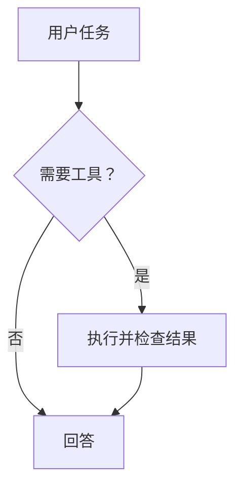

# Pi ACP Workbench

一个通过 **Agent Client Protocol（ACP v1）** 接入 Pi Agent 的 VS Code 插件。提供侧栏对话、流式回答、代码上下文、工具执行卡片和 diff 预览，重点增强 Markdown 与数学公式体验。

本项目是独立实现，并非 Pi、OpenAI 或 Anthropic 的官方插件。面向常见编码助手工作流；不宣称与 Codex / Claude Code 的所有功能等价。

## 安装与使用

### 1. 准备 Pi

在运行 VS Code 扩展宿主的机器上安装 Node.js 22+，按 [Pi ACP 适配器说明](https://github.com/svkozak/pi-acp) 安装 Pi 并配置模型供应商：

```bash
npm install -g @earendil-works/pi-coding-agent
pi
```

在 Pi 的交互界面完成登录或 API key 配置。插件复用 Pi 的凭据，不单独收集模型密钥。请使用支持原生会话树和 `fork(position: at)` 的 Pi。

### 2. 安装 VSIX

在 VS Code 的扩展面板菜单选择 **Install from VSIX…**，选择 `pi-acp-workbench-0.8.1.vsix`，或执行：

```bash
code --install-extension pi-acp-workbench-0.8.1.vsix
```

打开并信任项目文件夹 → 点击活动栏的 **π**。首次使用点击 **新建会话**；已有历史时自动恢复上次活动会话。只有点击新建（或执行 `Pi: New Session`）才创建空白对话，重新连接只恢复原会话，失败不会偷偷创建新对话。连接成功后输入任务，Enter 发送，Shift+Enter 换行。生成过程中可点击 **停止**。

按钮、模型选择器和上下文圆环的说明在悬停或键盘聚焦时立即显示统一的主题浮层，按 Esc 可关闭。上滑阅读历史时，可点击消息区底部居中的圆形箭头回到最新消息。错误提示右侧的 **×** 可关闭当前错误，后续错误仍会正常显示。

**不配置模型也可以体验渲染**：命令面板执行 `Pi: Preview Markdown & Math`。

### 3. 启动 Pi 会话服务

Pi 运行于独立的常驻服务，插件与 Telegram 共享它。先按 [会话服务部署文档](docs/session-service.md) 配置 `sessions.json` 并启动 `pi-sessions.service`，再连接插件。当前使用 Linux Unix socket；本地 Windows 不支持此运行方式，可使用 WSL 或 Remote SSH。

默认最多 3 个工作进程，空闲 15 分钟回收。关闭 VS Code 不会停止已经提交的任务；服务未启动时明确报错，不回退到插件启动 Pi。Pi 路径、代理、进程上限等在服务配置中设置，Bot token 仅属于 Telegram 接入。

插件默认连接 `~/.pi/pi-acp-workbench/service/sessions.sock`，可用 `piAcp.serviceSocket` 指定路径。Codex / Claude 的启动配置维持各自的设置键。凭据在执行服务的服务器账户下配置。

## 使用体验

- **流式聊天**：支持 assistant、thought、tool、plan、usage 更新；用户向上滚动后不强制跳回底部。
- **新建默认组合**：沿用当前/上次活动会话的模型和 thinking，选择成功即记忆，重启或关闭历史保存后也保留。先恢复模型，再应用其支持的思考选项；原选项已不可用时显示提示，供手动调整。恢复旧会话仍使用该会话自己的组合。
- **模型和思考模式**：根据 Agent 返回的 `configOptions` / `modes` 动态显示，不硬编码模型名。适配器不提供时不显示。
- **上下文**：编辑器右键 `Pi: Add Selection to Chat` 或 Ctrl+Alt+P / Cmd+Alt+P；无选区时附加当前文件。发送前可移除。读取当前编辑器内容，包含未保存修改。最多 8 个附件，单个默认上限 60,000 字符，超过会提示缩小选区。
- **Slash 命令**：输入 `/` 展示 Agent 声明的命令；点击插入。也可以直接发送 `/compact` 等文本命令。
- **执行过程折叠**：每轮的思考、工具调用及中间说明合并成默认折叠的“执行过程”，最终回答保持可见。可单独展开，也可用消息区上方按钮整体展开/折叠；这只影响显示，不修改 Agent 上下文。
- **输入区大小**：拖动输入区上方的分界线调整高度；聚焦分界线后可用上下方向键微调、Home/End 选择最小/最大高度，双击重置。高度随 Webview 草稿状态保存。
- **工具调用**：增量更新状态、位置、输出；结构化 `diff` 支持在 VS Code 中左右对比。这是已执行/报告修改的预览，不是延迟应用或回滚机制。
- **授权卡片**：完整展示 `session/request_permission` 工具信息和 Agent 的选项，原样返回所选 optionId；取消会返回 cancelled。
- **共享会话**：默认将全部插件历史保存到扩展宿主用户目录，不再只保留 20 条。同一服务器、同一 SSH 用户从不同电脑连接时共享列表和快照；打开其他工作区的会话可只读查看。
- **会话恢复**：点击历史记录后调用 `session/load`。不支持 load 的 Agent 会明确报错；不会把本地快照伪装成已恢复远端上下文。Pi 由服务按需加载原生会话，其他 harness 的恢复取决于适配器持久化能力。
- **导出**：导出对话正文的原始 Markdown 和工具摘要。
- **多根工作区**：创建会话时选择一个工作目录，历史会话绑定其原始目录。
- **远程开发**：扩展运行于 workspace 宿主。在 Remote SSH / WSL / Dev Container 中，需要在远端安装 Pi 和 Node，并在那里配置凭据。

## Harness 切换

左上角的 Harness 下拉框提供 **Pi Agent / Codex / Claude Code**。Pi 为默认，执行环境改由 `sessions.json` 管理。切换会保存并断开当前会话，释放共享会话锁；不会自动创建会话或把对话转发给另一家 Agent。目标 harness 已有记录时先只读展示，点击“重新连接”后才启动；没有记录时点击“新建会话”。生成、连接或上下文重建期间禁止切换。

草稿、待发送附件、最近模型偏好和活动会话指针按 harness 隔离。历史列表保留全部记录并标注 Codex / Claude Code，点击历史会切到其所属 harness。历史记录必须显式包含 harness 元数据；Codex / Claude 的原生 Session ID 使用独立的本地命名空间，不会覆盖同名 Pi 会话。共享同一历史目录的客户端应使用同一版本。

**空会话恢复**：Codex / Claude 在第一条消息之前可能只分配 Session ID，而不保存原生会话。释放后恢复时，如果适配器明确返回该 ID 不存在，且本地记录完整、没有任何消息，插件会重新建立空连接，保留会话编号与设置并显示提示；不会发送消息。已有内容、记录不完整、认证失败或其他错误不会触发此回退。无法恢复的原记录保留为只读，释放占用锁。

**Slash 命令**：连接就绪后，在输入框开头输入 `/` 查看适配器通过 ACP 宣告的命令，继续输入可筛选；支持滚动、方向键、Enter / Tab 补全和 Escape 关闭。选择命令只填入输入框，不立即执行。列表可异步更新，并不等同于终端 CLI 的全部命令；尚未连接或尚未收到列表时会显示提示。

### 安装与认证

**必须安装在扩展宿主上**（Remote SSH 时为服务器）。插件不自动下载、安装或捆绑下面的适配器：

```bash
npm install -g @agentclientprotocol/codex-acp
npm install -g @agentclientprotocol/claude-agent-acp
```

可自定义适配器路径及参数：

```json
{
  "piAcp.codex.command": "/absolute/path/to/codex-acp",
  "piAcp.codex.args": [],
  "piAcp.codex.env": {},
  "piAcp.claude.command": "/absolute/path/to/claude-agent-acp",
  "piAcp.claude.args": [],
  "piAcp.claude.env": {}
}
```

不能把普通的 `codex` / `claude` 交互命令当成 ACP 进程。所有命令参数直接传递，不经过 shell；各 profile 的 env 覆盖互不继承，但子进程仍继承扩展宿主的系统环境，这不是凭据或工具执行沙箱。

- **Codex**：可复用远端 Codex 凭据。登录按钮运行 `codex login`，需要另行可用的 Codex CLI（例如安装 `@openai/codex`）；非默认路径用 `piAcp.codex.loginCommand` 配置。SSH 的浏览器/设备码登录方式取决于 Codex CLI，必要时在终端使用其设备码流程。API key 模式使用 `CODEX_API_KEY` 或 `OPENAI_API_KEY`，当前适配器还需 `DEFAULT_AUTH_REQUEST={"methodId":"api-key"}` 选择认证方式。这些变量可由宿主环境提供，或使用 `piAcp.codex.env`；避免将凭据提交到仓库。
- **Claude Code**：复用远端 Claude 凭据或 `ANTHROPIC_API_KEY`。登录按钮使用适配器的 `--cli /login` 打开其内置 Claude Code 登录流程；无需让插件采集密钥。

### 支持范围

| 能力 | Pi 默认增强适配器 | Codex / Claude Code |
| --- | --- | --- |
| ACP v1 流式聊天、工具记录、权限回应、取消 | 支持 | 支持标准协议路径 |
| 图片、嵌入上下文、模型/思考选择器、slash 命令 | 按声明支持 | 按实际能力/通知显示 |
| 保存与恢复历史 | 支持 | 保存本地记录；恢复须声明 `session/load`，否则只读，不自动重放 |
| 原生上下文分支 | 支持（需内置增强适配器及可验证节点） | 第一阶段不提供 |
| Pi 详细计费、原生上下文检查 | 支持 | 不提供，不调用 Pi 私有扩展 |
| 客户端文件/终端委托、网关认证、原生子 Agent/后台任务扩展 | 不声明 | 不声明，依赖适配器自己的工具能力或标准回退 |

Codex 的 **Fast mode（On/Off）** 和 **Collaboration mode（Default/Plan）** 不再显示。新建/恢复时固定为 `off` 和 `default`；模型、思考强度、权限选择仍保留。On/Off 是快速服务档位，不是缓存或思考开关：当前 Codex 适配器说明 On 约为 1.5 倍速度、用量更高，Off 为正常速度和用量。

已用真实 `@agentclientprotocol/codex-acp@2.1.1` 与 `@agentclientprotocol/claude-agent-acp@0.85.1` 验证 ACP v1 初始化握手，均声明图片、嵌入上下文和历史恢复能力。初始化验证使用隔离用户目录；此外使用已有凭据验证了新建空会话、释放进程、恢复空连接和重新获取命令列表，没有发送 `session/prompt`。**真实模型端到端调用仍需在你的环境验证**。模拟协议测试覆盖发送、授权、取消、历史恢复、设置和 ID 隔离。

## Markdown 与数学支持

所有渲染依赖和 KaTeX 字体随 VSIX 打包；渲染本身无需 CDN 或网络。

| 内容 | 支持 |
| --- | --- |
| 标题、列表、引用、链接、分隔线 | 支持 |
| 表格、任务列表、删除线、脚注 | 支持 |
| 围栏代码、多语言高亮、复制代码 | 支持 |
| Mermaid 流程图、时序图等 | `mermaid` 围栏内渲染，保留可展开/复制的源码 |
| `$a^2+b^2=c^2$` | 行内公式 |
| `\(e^{i\pi}+1=0\)` | 行内公式 |
| `$$…$$`、`\[…\]` | 独立公式与横向滚动 |
| `align`、`aligned`、`gather`、`equation`、`cases`、矩阵等 | 常见 KaTeX 环境；见其支持列表 |
| 分数、积分、求和、上下标、向量、黑板粗体 | 支持 |
| `\ce{2H2 + O2 -> 2H2O}` | mhchem 化学式 |
| 辅助技术 | 同时输出 HTML 与 MathML |

公式通过 Markdown token 规则解析，不对全文做正则替换，因此代码围栏与行内代码中的 `$`、反斜杠保持原样。流式未闭合公式暂按普通文本显示；闭合后重新渲染。不支持的 LaTeX 命令显示公式源码，不会中断整个回答。宏在每个公式内部独立，不会污染后续消息。

KaTeX 不是完整 TeX 引擎：**TikZ、任意 LaTeX 宏包和原始 HTML 不在本版范围内**。模型输出的 Markdown 图片显示占位文字，不自动请求远程图片。价格 `$5 和 $10` 按普通文本处理；单美元公式遵循不以空白开始/结束等常见约定。

## 权限与数据边界

插件只在受信任的文件工作区启动本地进程。Webview 关闭脚本注入、远程网络请求与原始 HTML，渲染结果经过 DOMPurify 净化，KaTeX 使用 `trust: false`。外部链接仅允许 http / https / mailto；工作区文件链接经真实路径检查，不能借符号链接打开目录之外的文件。启动命令设置为机器级，避免仓库设置悄悄替换可执行程序。

**ACP 授权卡片不等于 Pi 工具沙箱。** `pi-acp` 底层 Pi 可以直接读写文件、运行命令，并不保证针对所有操作发出授权请求。只有 Agent 发来 `session/request_permission` 时插件才能展示审批。若需要强制逐次审批或严格隔离，应在 Pi/适配器或容器层实现；不要把 UI 中的授权按钮当成强制安全边界。本版不声明 `fs/*` 或 `terminal/*` 委托能力。

最近模型/thinking 偏好、活动会话指针、用量统计及价格仍按 VS Code 工作区保存，不在客户端之间同步。完整快照（可能包含代码、图片与对话）默认保存在 **扩展宿主** 的 `~/.pi/pi-acp-workbench/history/`；Remote SSH 下即服务器目录，不是本地电脑目录。目录/文件新建权限为 0700/0600（POSIX）。

共享模式下，`piAcp.persistHistory: false` 只隐藏并停止当前客户端的历史保存，不会清空其他客户端的共享记录；需要删除时使用历史列表的删除/清空按钮，并确认其影响所有客户端。`piAcp.sharedHistory: false` 后重载窗口可恢复原来的工作区本地存储模式；该模式下关闭持久化会清除本地快照。删除不擦除 Pi 原生文件、已有备份或计费记录。stderr 保留在 `Pi Agent` 输出面板以便诊断，插件不记录环境变量或 stdout 协议原文、不包含遥测。

## 开发

请先阅读 [贡献指南](CONTRIBUTING.md)、[架构与会话生命周期](docs/architecture.md) 和 [测试与发布](docs/testing.md)。它们说明了无 API key 调试、数据存储、会话创建边界及如何添加回归测试。

```bash
npm ci
npm test             # 日常：类型检查 + 受未提交改动影响的测试
npm run verify       # 提交 / 发布前：全部测试 + 构建 + 浏览器验证
npm run package      # 打包（prepublish 自动检查和构建）
```

在 VS Code 打开本项目，F5 启动 Extension Development Host。打包会在项目父目录生成 VSIX。

目录：

```text
src/agent.ts       ACP SDK / stdio / 进程生命周期
src/extension.ts   VS Code 侧栏、会话、授权、上下文和 diff
src/state.ts       流式更新归并
src/session-settings.ts 模型与思考选项解析、默认组合
src/shared.ts      Webview 通信类型
webview/           UI、Markdown / KaTeX token 解析与净化
scripts/           构建和真实浏览器检查
test/              协议模拟服务、渲染/状态测试、扩展宿主测试
```

协议模拟测试无需模型 key，覆盖初始化、能力协商、历史重放、分片 UTF-8、权限选择、取消、超时和进程退出。渲染测试覆盖流式公式、代码隔离、无效 LaTeX 和内容净化。`test/host.cjs` 可通过 VS Code 的 `--extensionTestsPath` 在独立测试 profile 下运行，需要 `PI_HOST_TEST_RESULT` 指定结果文件。

实际 Pi 模型推理需要用户自己的供应商账户。本交付的自动化测试不调用付费模型，不代表已验证所有供应商、Windows 或 Remote SSH 环境。

## 常见问题

- **ENOENT / 启动失败**：Pi 检查 `pi-sessions.service` 日志及 `sessions.json` 的可执行文件路径；其他 harness 检查各自启动设置。
- **认证失败**：运行 `Pi: Open Login Terminal` 或在终端执行 `pi`，完成认证后重新连接。
- **停止超时**：先发送 ACP cancel；5 秒仍未返回则终止连接和进程树，之后尝试从历史恢复。
- **会话无法恢复**：确认打开的是原工作目录，Pi 的持久化文件仍存在，且 Agent 支持 `session/load`。
- **日志**：执行 `Pi: Show Agent Logs`，检查适配器 stderr。

## 参考

- [ACP v1 初始化规范](https://agentclientprotocol.com/protocol/v1/initialization)
- [ACP TypeScript SDK](https://github.com/agentclientprotocol/typescript-sdk)
- [Pi ACP 适配器](https://github.com/svkozak/pi-acp)
- [VS Code Webview API](https://code.visualstudio.com/api/extension-guides/webview)
- [KaTeX 支持的函数](https://katex.org/docs/supported.html)

### 历史会话

点击顶部历史按钮查看此服务器账户的全部插件会话。每个持久化对话在历史列表和当前会话栏显示稳定编号（如 `#001`、`#002`），同名分支会获得不同编号；排序变化、重启不改变编号，空会话恢复导致后台 ID 替换时保留逻辑对话编号。编号在创建时分配，删除/清空后不复用旧号。共享模式下由服务器事务统一分配，各客户端一致；本地模式按工作区分配。悬停编号可查看完整 Session ID。列表最多显示 4 行，其余滚动查看；每 5 秒自动刷新，也可以点击“刷新”。其他工作区的会话可查看，但继续对话前必须打开对应工作区。Pi 的活动会话通过服务实时同步；断线重连会取得完整当前状态。

Pi 的同一会话可由桌面与手机同时连接，消息串行执行，授权只接受首次有效响应。**释放会话**只断开本窗口，任务继续；Pi 服务统一持有会话锁并回收空闲进程。Codex / Claude 仍采用窗口独占连接，释放后由另一窗口恢复。

Pi 始终由服务保存共享历史；关闭 `persistHistory` 只隐藏客户端列表，不停止服务保存任务。Codex / Claude 的本地模式与共享模式分别读取各自存储，不再自动迁移记录或给旧索引补号。只有明确保存的活动会话指针会自动恢复；没有指针时显示欢迎页，仍可主动从历史列表选择。缺少 harness 的旧记录或带 `contextPending=true` 的旧重建快照不再支持恢复，原文件保留，不会自动重建或重放。当前原生会话不受影响。不自动扫描 Pi CLI 的原生历史，也不跨服务器或 SSH 账户同步。

垃圾桶/清空按钮在共享模式下影响所有客户端，并弹出确认；删除不会中断当前任务，也不会被旧窗口自动保存复活。这里管理的是插件历史，Pi 自身保存的会话文件仍由 Pi 管理。


### 原生上下文分支

用户消息和 Agent 回答下方提供 **复制 / 分支**；工具卡片仅提供复制。逐条消息删除已移除，历史列表删除整段会话仍保留。

- **原生回溯**：Pi 分支使用原生会话树，包含所选消息及其之前的路径；原会话保留，新分支有独立编号。保留当时的原生消息、图片、工具结果、已有压缩记录和模型/思考设置，不把整个历史拼成新的用户消息，不为分支重新生成摘要，也不重放工具或回滚文件。
- **缓存边界**：保留原生前缀避免了人为重建导致的内容变化，但不保证供应商缓存命中。新分支仍有新 Session ID；例如 Pi 的 openai-codex 请求会由 Session ID 派生 `prompt_cache_key`，缓存路由可能变化。模型、系统提示和缓存有效期也会影响命中；后续正常自动压缩仍可能发生。
- **安全定位**：仅空闲、已连接且可唯一定位到安全原生节点时可分支；无法定位的旧记录、待完成工具调用和只读历史会禁用按钮，不降级为文本摘要。操作期间显示进度与取消按钮；失败或取消保留原会话，源连接已断开时提供重新连接。首次接入旧历史可能需刷新原生映射。
- **适配器**：需要支持原生 fork 的 Pi 和内置增强适配器。Codex、Claude 及不支持该扩展的外部 Pi 适配器暂不提供分支。
- **复制**：仍复制本地原始 Markdown；压缩不会把界面全文或复制内容替换成摘要。旧版已缺失的内容不能凭空恢复。
- **恢复边界**：仅恢复原生会话，不再提供旧版文本种子重放、分块摘要或待同步快照迁移。Pi 自身的正常自动压缩继续由 Pi 管理。

### 流程图

模型输出完整的 `mermaid` 代码围栏后自动渲染，例如：

````markdown

````

流式未闭合围栏暂显示代码，闭合后绘图；错误图表保留源码并显示提示，不影响其他 Markdown/公式。使用打包的 Mermaid、strict 模式及二次 SVG 净化，无 CDN、无远程图片/链接交互；不支持图内配置指令和 YAML frontmatter，限制图表大小与边数。主题跟随 VS Code。

### 用量统计与价格

右上角柱状图按钮切换到统计页面，支持 **按模型 / 按天 / 按会话** 汇总及日期筛选：缓存读取 token、总输入 token、输出 token、缓存命中率、估算费用。

- 来源为内置适配器读取 Pi 原生会话中逐次请求及压缩的 `usage`，按稳定请求 ID 去重；上下文圆环的当前占用不作为累计消费。数据归属当前 VS Code 工作区；打开旧会话时补录其仍存在的原生用量，尚未打开的旧会话不自动遍历。
- 总输入 = 非缓存输入 + 缓存读取 + 缓存写入；命中率 = 缓存读取 / 总输入。模型没有报告的请求无法追补或准确估算。
- 原生分支通过元数据标记排除继承的旧用量，新请求计入新会话；历史消费不会因分支或清理记录而消失。清理本地历史不会删除统计。
- 价格单位 **USD / 1M token**。预置常用 OpenAI 和 Anthropic 模型价格，其他模型优先读取 Pi 模型配置；无法确定时标记“未定价”。点击“模型价格设置”进入独立页面，仅列出 Agent 当前配置、可选的模型。每个模型都有非缓存输入、缓存读取、缓存写入、输出四个输入框及独立的保存/恢复默认按钮；保存即重算统计。尚未使用但已配置的模型也可修改单价。
- 预置基于 2026-10-03 [OpenAI 标准短上下文 API 价格](https://developers.openai.com/api/docs/pricing)与 [Anthropic API 价格](https://platform.claude.com/docs/en/about-claude/pricing)，缓存写入采用常规短期档。不同供应商代理、区域、长上下文、缓存时长、订阅或优惠会影响账单，估算不等于实际扣费。用户设置优先于预置和 Pi 配置。
- 普通 ACP 只提供上下文占用时，会显示详细用量不可用；已有统计保留，不伪造缓存或费用。


### Telegram 远程控制

支持独立 Node.js 服务常驻服务器，关闭 VS Code 后仍可从手机控制 Pi。私人群组的每个 Topic 对应一个会话，支持增量更新回复、完成通知、权限按钮和 `/stop`，通过用户及群组白名单限制访问；工作目录不限，按服务器账户的文件权限运行。

配置与 systemd 部署见 [Telegram 配置文档](docs/telegram-setup.md)，命令与手机控制见 [日常使用指南](docs/telegram-usage.md)。运行 `npm run build` 后通过 `npm run telegram -- --config /absolute/path/telegram.json` 启动；Bot token 由环境变量提供。先部署 [Pi 会话服务](docs/session-service.md)。桌面与手机连接同一个执行服务，执行中消息排队；支持旧会话历史同步和全局推送开关。全局推送默认开启，`/notifications` 控制投递，`/silent` 独立控制静音发送（默认关闭）。

### 会话连接缓存

仅在 `piAcp.sharedHistory: false` 的本地模式下，本次扩展运行中最近使用的空闲会话会保留在内存中，再次选择可直接复用已有 ACP/Pi 连接、消息和设置，无须重复初始化或加载。当前会话之外最多保留 **2 个空闲连接**，缓存记录按序列化大小合计最多 **32 MiB**；超过时释放最久未使用的连接，单个超预算会话不进入缓存。这个预算限制记录数据，进程自身也会使用额外内存。

缓存不写入磁盘；扩展停用或 VS Code 关闭时释放，Webview 被销毁时也会释放空闲缓存。重启后从空缓存开始，已有持久化历史不受影响。删除/清空历史、修改 ACP 启动配置会释放相应缓存；已断开的缓存自动走正常重连。首次打开或被淘汰的会话仍需连接。生成期间仍需先停止再切换，避免后台任务误操作。

### 粘贴图片

在输入框按 **Ctrl+V / Cmd+V** 粘贴截图或剪贴板图片，显示缩略图后可用 × 移除，也可以只发送图片。支持 PNG、JPEG、WebP、GIF；单张最多 **3 MiB**，每条消息图片合计最多 **6 MiB**，图片和代码附件合计最多 8 个。超过限制会明确提示，不自动降质。

图片使用 ACP `image` 内容块发送；需要 Agent 声明图片能力，并选择支持视觉输入的模型。图片原文随消息保存在本地快照中，历史恢复后可以查看；关闭历史保存可禁用插件持久化。异步粘贴过程中切换会话会拒绝把图片加入其他会话。Webview 仅为本地图片预览开放 `data:` 图片，不开放远程 Markdown 图片加载。

原生分支保留 Pi 原生图片内容，不重新编码或改写为文字。旧版文本上下文重建已移除。
